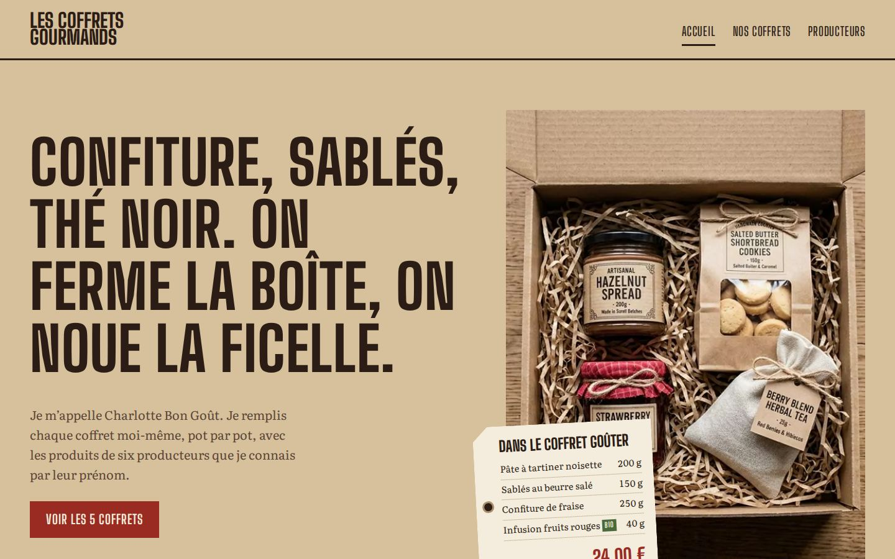

# Les Coffrets Gourmands

Site vitrine HTML/CSS de Charlotte Bon Goût, auto-entrepreneure qui vend des coffrets gourmands.
BTS SIO 1re année, bloc 1.

**[Voir le site](https://coffret-gourmand.netlify.app)**



## Dossier

- [`docs/mission-1.md`](docs/mission-1.md) : activité introductive, inventaire du matériel, comparatif de deux solutions à 1 200 € HT
- [`docs/mission-2.md`](docs/mission-2.md) : recueil des besoins, arborescence, justification des choix, mise en ligne, tests, limites

## Pages du site

- [`index.html`](index.html) : accueil, présentation, prix des 5 coffrets
- [`coffrets.html`](coffrets.html) : détail des coffrets, vidéo, tableau, bon de commande
- [`producteurs.html`](producteurs.html) : les 6 producteurs partenaires

## Ouvrir

Télécharger le ZIP (**Code**, puis **Download ZIP**), ouvrir le dossier dans VS Code, puis ouvrir `index.html` dans le navigateur ou avec Live Server.

## Structure

```
index.html  coffrets.html  producteurs.html
assets/     style.css, images, audio, vidéo, polices
docs/       dossier de projet et captures
```

## Crédits

Photos générées par IA · Vidéo [Pexels 7855140](https://www.pexels.com/video/7855140/) · Son Pixabay · Polices Big Shoulders Display et Literata (SIL OFL).
Entreprise, producteurs et prix fictifs. Code sous licence [MIT](LICENSE).
