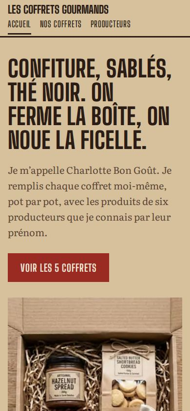
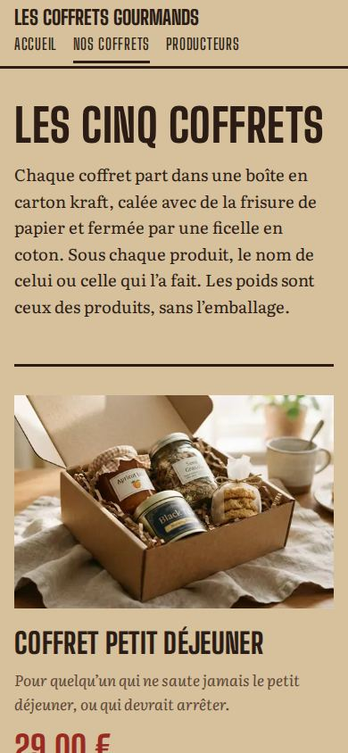
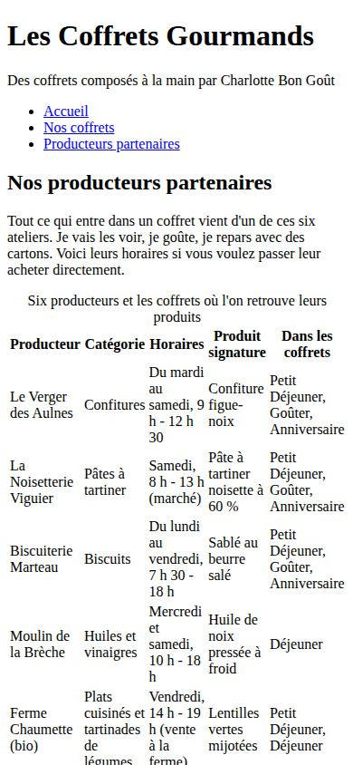

# Dossier de projet

Les Coffrets Gourmands · BTS SIO 1re année · Bloc 1 · Mission 2

## 1. Contexte

Charlotte Bon Goût, auto-entrepreneure, lance la vente en ligne de coffrets gourmands (confitures, biscuits, pâtes à tartiner, épices, huiles, thés, produits bio). Elle souhaite un site pour présenter ses cinq coffrets : Petit Déjeuner, Déjeuner, Goûter, Anniversaire et Surprise.

## 2. Recueil des besoins

**Besoins de Charlotte**

- Faire connaître son activité et donner envie de commander.
- Présenter clairement les 5 coffrets, leur contenu et leur prix.
- Mettre en avant l'origine locale des produits, qui la distingue de la grande distribution.
- Recevoir des demandes de commande.

**Utilisateurs du site**

- Des particuliers qui cherchent un cadeau (anniversaire, remerciement, surprise).
- Des amateurs de produits locaux et bio qui veulent savoir d'où viennent les produits.
- Des visiteurs sur téléphone, qui découvrent souvent le site depuis les réseaux sociaux.

**Informations à mettre à disposition**

- Contenu exact, poids et prix de chaque coffret.
- Nom, horaires et produit phare de chaque producteur.
- Délai de préparation, tarif de livraison, emballage.
- Un moyen de commander, avec un message personnalisé pour la carte.

## 3. Arborescence

```
Accueil ──┬── Nos coffrets ── Bon de commande
          └── Producteurs partenaires
```

Un menu identique sur les trois pages. L'accueil renvoie vers chaque coffret, et la page Producteurs vers les coffrets qui contiennent leurs produits.

## 4. Justification des choix

| Élément | Choix | Valeur pour Charlotte |
|---|---|---|
| Accueil | Charlotte se présente à la première personne | Crée la confiance : on achète à une personne, pas à une enseigne |
| Étiquette du Coffret Goûter | Liste réelle des produits avec leur poids | Le client voit tout de suite ce qu'il achète |
| Ardoise des prix | Les 5 coffrets et leur prix sur un seul bloc | Comparaison immédiate, chaque ligne mène au coffret détaillé |
| Infos pratiques | Préparation, livraison, carte, emballage | Répond aux questions avant l'achat et évite des messages |
| Son du marché | Ambiance du marché du samedi | Transmet l'univers artisanal et local |
| Nos coffrets | Contenu, poids et producteur de chaque produit | Traçabilité : justifie le prix et rassure |
| Vidéo | Préparation d'une commande | Montre le travail fait à la main |
| Tableau récapitulatif | Produits, bio, usage, prix | Aide à choisir en quelques secondes |
| Bon de commande | Choix du coffret, quantité, mot pour la carte | Transforme la visite en commande et valorise l'aspect cadeau |
| Producteurs | Tableau nom, catégorie, horaires, produit signature | Valorise le circuit court et les partenaires |
| Identité visuelle | Couleurs du kraft et de la cire, police au pochoir des caisses de marché | Image artisanale cohérente, différente des sites génériques |
| Adaptation au téléphone | Mise en page qui se réorganise sur petit écran | Une grande partie des visiteurs arrive depuis un téléphone |
| Accessibilité et référencement | Textes alternatifs des images, titres et descriptions de page | Site lisible par tous et mieux trouvé sur les moteurs de recherche |
| Médias | Vidéo Pexels, son Pixabay, polices sous licence libre | Aucun risque juridique lié aux droits d'auteur |

## 5. Mise en ligne

- **Réseau du BTS** : dossier `coffrets gourmands` dans le répertoire personnel.
- **Web** : hébergement gratuit Netlify, https://coffret-gourmand.netlify.app
- **Code source** : https://github.com/svjAbdel/Coffret-gourmand

## 6. Tests

- Validation HTML (html-validate) : 0 erreur sur les 3 pages.
- Liens et fichiers : aucun lien cassé.
- Affichage vérifié sur ordinateur (1440 px) et téléphone (390 px).

<p>
  
  
  
</p>

## 7. Limites et évolutions

- Le bon de commande n'envoie rien : il faudrait le relier à un service d'envoi de formulaires (Netlify Forms, Formspree).
- Pour vendre réellement : paiement en ligne (Stripe, SumUp) ou boutique clé en main (Shopify, WooCommerce).
- Obligations légales à ajouter avant ouverture : mentions légales, conditions générales de vente, politique de confidentialité (RGPD).
- Remplacer les photos générées par de vraies photos des coffrets de Charlotte.
